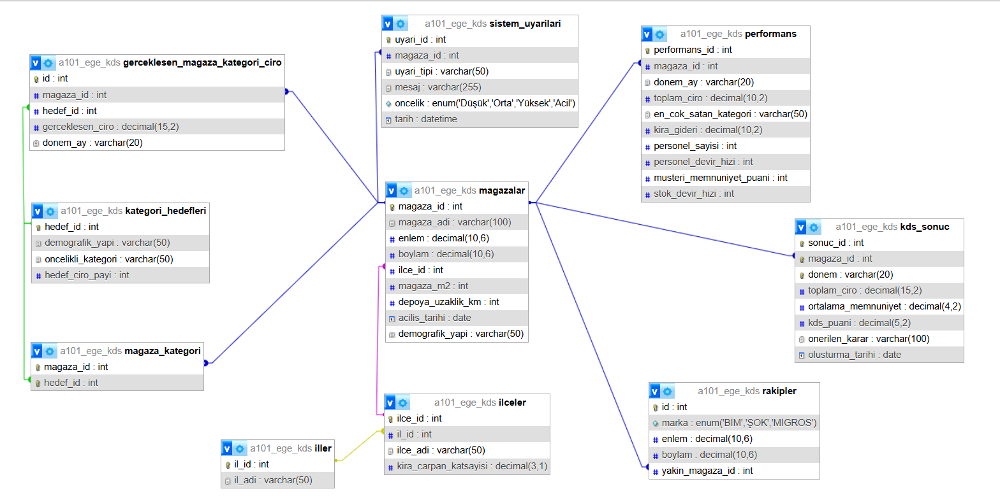

# A101 Ege Bölge Müdürlüğü - Karar Destek Sistemi

## Proje Açıklaması
Bu proje, A101 Ege Bölge yöneticilerinin binlerce mağaza verisi arasında kaybolmadan, veriye dayalı ve doğru kararlar almasını sağlayan web tabanlı bir yönetim sistemidir. Sistem, sadece satış rakamlarını göstermekle kalmaz; arka planda çalışan akıllı algoritmalar sayesinde hangi mağazanın riskli olduğunu, hangisinin kapatılması gerektiğini veya nerede fırsat olduğunu analiz eder.

### Sistemin Çözdüğü Temel Sorunlar ve Özellikler
* **Mağaza Başarı Puanı (KDS Skoru):** Sistem; kira gideri, ciro, personel performansı ve müşteri memnuniyeti verilerini birleştirerek her mağazaya 0 ile 100 arasında bir "Başarı Puanı" verir. Bu sayede yönetici tek bakışta hangi mağazanın "Mükemmel", hangisinin "Acil Müdahale Gerektiren" durumda olduğunu görür.
* **Yamyamlık (İç Rekabet) Tespiti:** Harita üzerinde birbirine çok yakın (500 metreden az) olan şubeleri analiz eder. Eğer yeni açılan bir şube, eski şubenin cirosunu düşürüyorsa sistem bunu tespit eder ve "İç Rekabet Riski" uyarısı verir.
* **Gelecek Senaryoları (What-If Analizi):** Yöneticiye "Geleceği görme" imkanı sunar. Örneğin; *"Önümüzdeki ay kiralara %50 zam gelirse hangi mağazalar zarar etmeye başlar?"* sorusunun cevabını, maliyetler artmadan önce simülasyon ekranında gösterir.
* **Otomatik Güvenlik Kilidi:** Bir mağazanın kira gideri, cirosunun %20'sini aştığı anda sistem otomatik olarak devreye girer. Mağaza diğer konularda iyi olsa bile sistem puanını düşürür ve yöneticiye *"Bu mağaza finansal olarak sürdürülemez, kapatılmalı veya taşınmalı"* uyarısı gönderir.

## 🛠 Projenin Teknik Yapısı
Proje, sürdürülebilir ve güvenli yazılım standartlarına göre geliştirilmiştir:

* **Düzenli Kod Yapısı:** Kodlar, geliştirilmesi ve yönetilmesi kolay olan **MVC (Model-View-Controller)** yapısında klasörlenmiştir.
* **Veri Güvenliği:** Veritabanı şifreleri kodun içinde açıkça yazmaz, özel güvenlik dosyalarında (`.env`) saklanır.
* **Veri Yönetimi:** Sistem üzerinden yeni mağaza ekleme, güncelleme ve silme (**CRUD**) işlemleri yapılabilir.

---

## Senaryo Tanımı ve İş Kuralları
Bu proje, verilerin sadece kaydedildiği pasif bir sistem değil; tanımlanan iş kurallarına göre veriyi denetleyen ve yöneticiyi yönlendiren **"Olay Güdümlü" (Event-Driven)** bir yapıya sahiptir. Sistemde tanımlı iki temel kritik senaryo ve iş kuralı aşağıdadır:

### 1. Senaryo: Mekansal Yamyamlık (Cannibalization) Kontrolü
Perakende yönetiminde en büyük risklerden biri, yeni açılan bir mağazanın mevcut mağazanın cirosunu bölmesidir.

* **Olay:** Sisteme yeni bir mağaza kaydı girildiği an (INSERT işlemi).
* **İş Kuralı:** *"Eğer yeni eklenen mağazanın kuş uçuşu **500 metre** yarıçapında başka bir A101 şubesi varsa; sistem bunu 'Normal Bir Açılış' olarak kabul etmez."*
* **Sistem Aksiyonu:**
    1.  Sistem, veritabanı seviyesinde çalışan bir Tetikleyici (Trigger) ile mesafeyi otomatik hesaplar.
    2.  Kural ihlali tespit edilirse, mağaza kaydı yapılsa bile sistem o bölge için otomatik olarak **"Yüksek İç Rekabet Riski"** uyarısı oluşturur.
    3.  Yönetici panelinde bu mağazalar Kırmızı Pin ile işaretlenerek *"Bu lokasyon hatalı olabilir, tekrar değerlendir"* mesajı verilir.

### 2. Senaryo: Finansal Sürdürülebilirlik Kilidi (Kira/Ciro Dengesi)
Yüksek cirolu mağazaların kârlı olduğu yanılgısını önlemek için sisteme finansal bir emniyet sibobu konulmuştur.

* **Olay:** Mağazaya ait aylık ciro ve kira gideri verisinin sisteme girilmesi.
* **İş Kuralı:** *"Bir mağazanın Kira Gideri / Toplam Ciro oranı **%20** eşiğini asla aşmamalıdır. Aşarsa mağaza 'Zarar Eden' statüsündedir."*
* **Sistem Aksiyonu:**
    1.  Veri girildiği anda arka plandaki algoritma oranı hesaplar.
    2.  Eğer oran %20'den büyükse; mağazanın diğer puanları (Müşteri memnuniyeti, personel vb.) ne kadar yüksek olursa olsun, sistem **Genel Başarı Puanını (KDS Puanı) otomatik olarak 0'a düşürür.**
    3.  Mağaza, performans listesinde en alta atılır ve statüsü **"ACİL: Kapatılmalı veya Taşınmalı"** olarak güncellenir.

*(Bu kural, şirketin zarar etmesini engelleyen katı bir finansal bariyerdir.)*

---

## Kurulum Adımları
Projenin yerel makinede çalıştırılması için aşağıdaki adımları takip ediniz:

**1. Projeyi Bilgisayarınıza İndirin**
Projeyi GitHub üzerinden klonlayın veya ZIP olarak indirip bir klasöre çıkarın:

    git clone [https://github.com/asmincelikk/kds-projesi-2026.git](https://github.com/asmincelikk/kds-projesi-2026.git)

**2. Gerekli Paketleri Yükleyin**
Proje dizininde terminali açın ve bağımlılıkları yüklemek için şu komutu çalıştırın:

    npm install

**3. Veritabanı Bağlantı Ayarlarını Yapın (.env)**
Proje güvenliği için veritabanı şifreleri kod içinde yer almaz.
* Ana dizinde bulunan `.env.example` dosyasının adını **`.env`** olarak değiştirin.
* Bu dosyanın içine kendi MySQL bağlantı bilgilerinizi (Kullanıcı adı, Şifre vb.) girin.

**4. Veritabanını İçe Aktarın**
* MySQL arayüzünüzü (phpMyAdmin veya Workbench) açın.
* `a101_ege_kds.sql` dosyasını "Import" (İçe Aktar) seçeneği ile sisteme yükleyin.
*(Not: Tablolar ve Trigger'lar otomatik olarak oluşturulacaktır.)*

**5. Projeyi Başlatın**
Aşağıdaki komut ile sunucusu ayağa kaldırın:

    node app.js

Tarayıcınızdan `http://localhost:3000` adresine giderek uygulamayı görüntüleyebilirsiniz.

---

## API Endpoint Listesi
Proje, istemci (frontend) ve sunucu (backend) arasındaki iletişimi aşağıdaki RESTful API uç noktaları üzerinden sağlamaktadır.

### 1. Mağaza Yönetimi 
Sisteme veri girişi, güncelleme ve silme işlemlerinin yapıldığı temel yönetim katmanıdır.

| Metot | Endpoint | Açıklama |
| :--- | :--- | :--- |
| **GET** | `/api/magazalar` | Sistemdeki kayıtlı tüm mağazaları listeler. |
| **GET** | `/api/magazalar/:id` | ID'si verilen mağazanın detay bilgilerini getirir. |
| **POST** | `/api/magazalar` | **[Create]** Sisteme yeni bir mağaza ekler (Trigger'ları tetikler). |
| **PUT** | `/api/magazalar/:id` | **[Update]** Mevcut bir mağazanın verilerini günceller. |
| **DELETE** | `/api/magazalar/:id` | **[Delete]** Belirtilen mağazayı sistemden siler. |

### 2. Stratejik Karar Destek Analizleri
Yöneticiler için "Büyük Resmi" gösteren ve algoritmik hesaplamalar içeren ana analiz servisleri.

| Metot | Endpoint | Açıklama |
| :--- | :--- | :--- |
| **GET** | `/api/cannibalization` | **Yamyamlık Analizi:** Birbirini negatif etkileyen yakın mağazaları tespit eder. |
| **GET** | `/api/tum-magazalar-kds` | Tüm mağazaların hesaplanmış **KDS Başarı Puanlarını** ve sıralamasını getirir. |
| **GET** | `/api/senaryo-verileri` | **What-If Analizi:** Geleceğe yönelik simülasyon verilerini sağlar. |
| **GET** | `/api/karsilastir` | Seçilen mağazaların performanslarını yan yana kıyaslar (Benchmarking). |
| **GET** | `/api/top-magazalar` | En yüksek performansa sahip "Mükemmel" mağazaları listeler. |
| **GET** | `/api/competitor` | Rakip marketlerin (BİM, Şok vb.) konum ve yoğunluk analizini getirir. |

### 3. Operasyonel ve Detay Analizler
Mağazaların alt kırılımlardaki (İK, Stok, Finans) performansını inceleyen servisler.

| Metot | Endpoint | Açıklama |
| :--- | :--- | :--- |
| **GET** | `/api/kira-analizi` | Mağazaların Kira/Ciro oranlarını ve risk durumlarını getirir. |
| **GET** | `/api/ik-analizi` | Personel devir hızı (Turnover) ve memnuniyet ilişkisini analiz eder. |
| **GET** | `/api/lojistik-analizi` | Mevsimsellik etkisiyle oluşan stok ve lojistik ihtiyaçlarını raporlar. |
| **GET** | `/api/hedef-analizi` | Mağazaların kategori bazlı satış hedeflerini tutturma oranlarını getirir. |
| **GET** | `/api/aylik-ciro` | Bölge genelindeki aylık ciro trendini getirir. |

### 4. Mağaza Özelinde Derinlemesine Analiz
Tek bir mağazaya odaklanıldığında kullanılan detay servisleri.

| Metot | Endpoint | Açıklama |
| :--- | :--- | :--- |
| **GET** | `/api/magaza-performans/:id` | Seçilen mağazanın özet performans kartını getirir. |
| **GET** | `/api/magaza-detayli/:id` | Mağazanın tüm metriklerini içeren detaylı raporu sunar. |
| **GET** | `/api/magaza-benchmark/:id` | Mağazayı il/ilçe ortalamalarıyla kıyaslar. |
| **GET** | `/api/magaza-kira-ciro/:id` | Mağazanın geçmişe dönük kira ve ciro değişim grafiğini sunar. |
| **GET** | `/api/suggestions` | Düşük performanslı kategoriler için **Planogram önerileri** üretir. |

---

## Veritabanı Tasarımı (ER Diyagramı)
Projenin veritabanı şeması ve tablolar arası ilişkiler aşağıdadır:

